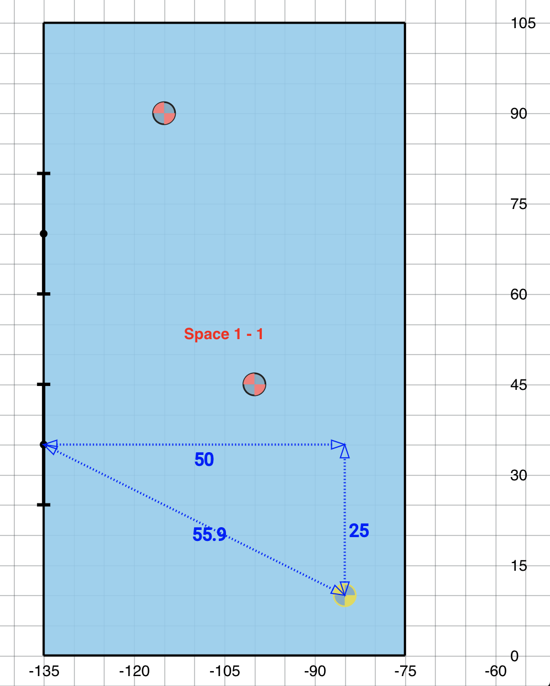

# Exhaustiveness Checking

On the [NREL/floorspace.js](https://github.com/NREL/floorspace.js) project, we have a handful of "component types" that represent windows and daylighting controls in a building floorplan. Depending on which component type is "active" we decide whether a click event will place a window or a daylighting control:



The code for this piece looks something like this:

```javascript
placeComponent() {
  if (this.currentComponentType === 'daylighting_control') {
    this.placeDaylightingControl();
  } else if (this.currentComponentType === 'window') {
    this.placeWindow();
  } else {
    throw new Error(`unrecognized componentType: ${this.currentComponentType}`);
  }
}
```

When we wrote this, we had the idea that "We'll add a door component type in the future, maybe a couple others". So we left the error message in place as a reminder of where we would need to update.

Of course, placing a component is not the only thing we need to do. We'll also need to highlight, select, remove, etc. I counted about 6 places throughout our code where we had an if statement similar to that one.

Now, the day comes when we want to add door components. **How do we find all the if statements?** I searched through the codebase for `daylighting_control_definitions` and found most of them. I also had to wade through some code that only dealt with daylighting controls. A couple more cases were found via bug reports.

If I'd been using typescript, here's how that might have looked.

```typescript
type ComponentType = "daylighting_control" | "window";
```

```typescript{10}
placeComponent() {
  // at it's definition, this.currentComponentType is declared to be
  // a ComponentType
  if (this.currentComponentType === 'daylighting_control') {
    this.placeDaylightingControl();
  } else if (this.currentComponentType === 'window') {
    this.placeWindow();
  } else {
    // this is the only new line
    const expectUnreachable: never = this.currentComponentType;
    throw new Error(`unrecognized componentType: ${this.currentComponentType}`);
  }
}
```

Now, watch what happens when we add a new case to the `ComponentType`union.

```typescript
type ComponentType = "daylighting_control" | "window" | "door";
```

Line 10 of the snippet above will complain:

```text
Type '"door"' is not assignable to type 'never'
```

Typescript "narrows" the possibilities of what `this.currentComponentType` could be based on the if statements. You can imagine it thinking:

> Okay, they've checked for `'daylighting_control'`, now the only options are 'window' and 'door'. There's a check for `'window'`, so if we land in this else block the only possibility is `'door'`. What?!? They're assigning us to a `never` value? But there's still one option left. I better say something.

I find this to be a useful enough tool that I usually define a helper method to make it more clear why I'm making a variable and not doing anything with it.

```typescript
function assertUnreachable(x: never): never {
  throw new Error("Unexpected object: " + x);
}
```

### References

- [the TypeScript docs on Exhaustiveness Checking](https://www.typescriptlang.org/docs/handbook/advanced-types.html#exhaustiveness-checking)
