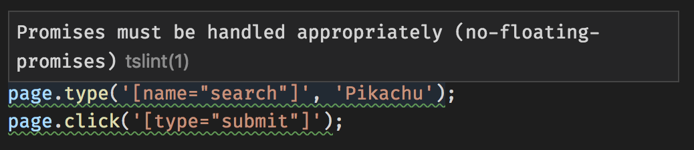

# Forgetting to await

The project I'm on at work uses [puppeteer](https://pptr.dev/) to interact with a running web page from node. All the communication with the browser is asynchronous, so there are Promises everywhere. Here's a helper function we've written to find a matching DOM element that contains some text.

```javascript
function _findOneWithText(selector, value) {
  // this function will be run in the browser context,
  // not the node context
  return Array.from(document.querySelectorAll(selector)).filter(elem =>
    elem.textContent.includes(value)
  )[0];
}

async function findOneWithText(page, selector, value) {
  return page.evaluateHandle(_findOneWithText, selector, value);
}
```

It's easy to assume these functions will return right away because they look just like the synchronous browser APIs we're used to. But they don't! `page.evaluateHandle` returns a Promise. What happens if we forget, and treat it like an `HTMLElement`?

```javascript
function learnMoreLink(page) {
  const link = findOneWithText(page, ".typescript a", "learn more");
  return link.getProperty("href");
}
```

In regular javascript, we'd have to wait until runtime to find out our mistake. Or maybe we're lucky enough to have a test that covers this case. What about with TypeScript?

This is one of the happy occasions when TypeScript can help us with _zero additional work_. If you add no annotations, typescript will warn you that

> Property 'getProperty' does not exist on type 'Promise&lt;any&gt;'

The TypeScript compiler is smart enough to know that async functions always return promises, even though we didn't tell it what the promise will resolve to. And promises don't have a method called `getProperty`.

### Promises without a value

Some puppeteer functions produce promises that don't have a return value, but just resolve to indicate that the action is complete. For example, `page.type` has no meaningful result, but will resolve to say "all done typing into the browser".

```typescript
page.type('[name="search"]', "Pikachu");
page.click('[type="submit"]');
// maybe a race condition! We might not be done typing 'Pikachu' at
// the time we click submit
```

TypeScript alone won't catch this, but [tslint](https://palantir.github.io/tslint/) can warn you about these "floating" promises.



### References

- [https://palantir.github.io/tslint/rules/no-floating-promises/](https://palantir.github.io/tslint/rules/no-floating-promises/)
